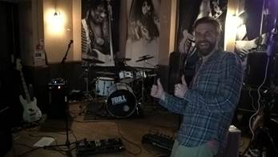
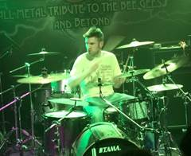

# Johnny da Storm -- Drummer
also writer, composer, recorder, mediocre guitar player and terrible keyboard player

*johnnysd [at] gmail [dot] com*

Hello, I recently moved to London from Glasgow. Never been a full-time musician, but I've played in bands constantly since I was about 13 (I'm now 35). I'm looking for paid work in and around London, probably a function band, but I will consider anything. The perfect workload would probably be 3-6 gigs per month but I am adaptable. Available now. I have a car. I have a nice kit. References available on request.

### 2018-2019     Till Death Do Us Party (function band - occasional depping)
Depped twice at weddings in St Andrews and Glasgow.
<https://www.tilldeathdousparty.co.uk/?fbclid=IwAR1uxVs7KsuaCMb7sOvWSMKOuMLVLao_EbrQuzt6HuvoMN5qZ6cSglj9pzM> (not me in the video)

### 2015-2019     Greenfinch (5 piece rock band built around a Nick Drake type dude)
Mostly played in Glasgow with occasional festivals and trip to Edinburgh and small towns.
<https://www.youtube.com/channel/UC4e77bSCf4PqQZwBbyEZh1g>

### 2014-2018     The Bill: A tribute to The Police and Sting
Mostly played around Scotland with occasional trips to Ireland and England.
<https://www.youtube.com/channel/UCu_ckEBLm6tOMb7QsPATXdw>

### 2012-2014     The Redettes (3-woman fronted mash-up cabaret style band)
Gigs around Scotland including headlining Cabaret Tent at T In The Park 2013.
<https://www.youtube.com/watch?v=SirYYyRKORg>

### 2010-2011     The Byers Road Big Band (big band jazz)
Monthly gigs in a Glasgow pub and other events.

### 2007-2011     Various unnoteworthy projects
None of which got out of the rehearsal room.

### 2003-2007 + reunions     Minus Won (grungy math-metal)
Gigs around Glasgow with occasional trips around Scotland.
<https://minuswon.bandcamp.com/>

### 2003-2007     Astronauts Fail (jaggy alt rock)
Gigs around Glasgow with occasional trips around Scotland and to Northern Ireland.

### 2003-present The Musical Destiny Project (mixed, rock-centred)
Solo project where I play everything, never gigged except solo acoustic.
<https://tmdp.bandcamp.com/>

### 1997-2002     High School bands (rock and jazz)
Perth battle-of-the-bands finalists in 2002 if memory serves me correctly!

